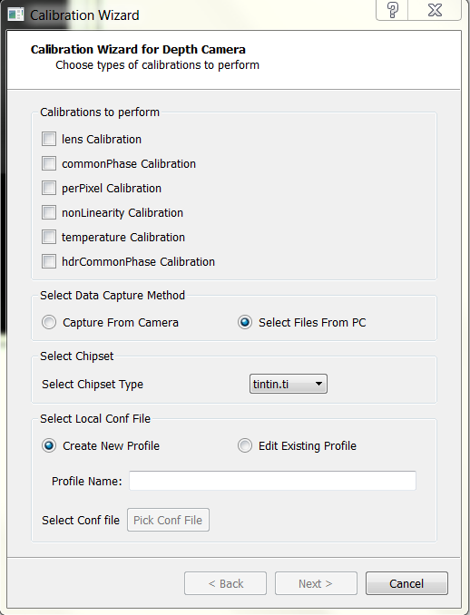

Calibration Wizard
=====================

The calibration wizard can be used for calibration using existing files as well as by capturing data in place. The following data is required for offline calibration :

+------------------+----------------------------------------------------------------------------+
| Calibration      | Data Required                                                              |	
+==================+============================================================================+
| Lens             | Checkerboard images                                                        |	
+------------------+----------------------------------------------------------------------------+
| Common Phase     | VXL of a camera pointing to a flat wall                                    |
+------------------+----------------------------------------------------------------------------+
| Per Pixel Offset | VXL of a camera pointing to a flat wall                                    |	
+------------------+----------------------------------------------------------------------------+
| Non Linearity	   | CSV file containing measured distance and phase values at the center pixel	|
+------------------+----------------------------------------------------------------------------+
| Temperature      | CSV file containing temperatures vs phase values, in a temperature chamber	|
+------------------+----------------------------------------------------------------------------+

Data for lens, common phase and pixelwise phase offset calibration can be captured live, using a depth camera. For all other calibrations, it is advised to use existing data captured using voxel viewer. 

Starting the wizard
---------------------
The wizard can be started by running the CalibrationWizard.py file. The first page that comes up is the following:

	
Here, you can select which calibrations are required to be performed. Also, if you already have captured data using Voxel Viewer, you can select the "Select files from PC" parameter. Otherwise, choose "Capture from Camera."

.. note: If you select capture from camera and only one camera is selected, you will be asked to choose the depth camera. Connect the camera and select it. If the wizard is unable to connect to the camera, it will select the "Select files from PC" as default.

Capture From Camera
#########################

Once you select a camera, you'll be asked to select a new profile or edit an existing profile present in the camera. If you create a new profile, you need to select a parent. Else, if you're editing an existing profile, the conf file of that profile is changed. 

.. note: Common Phase Offset, PixelWise Phase Offset and Lens Calibrations are the only calibrations which can be performed using live capture. For all other calibrations, you require pre-captured/pre-calculated data. 

Select Files From PC
######################

If you choose to select files from PC, you need to provide the information for the chipset being used. The wizard currently supports the use of **TintinCDKCamera** and **CalculusCDKCamera** chipsets. To know the camera chipset, open Voxel Viewer and look for the camera name. It can be seen in the following image:

Apart from the camera name, you need to provide the conf file which was used for capturing the data. You have the option to edit this file or create a new profile, whose parent will be the conf file you pick. 

Selecting the strategy for calibration
------------------------------------------
The second page of the wizard asks for the specific strategy with which you wan to do a particular calibration. The different types of calibrations are as follows:

+------------------+----------------------------------------------------------------------------+
| Strategy         | Calibration(s)                                                             |	
+==================+============================================================================+
| FlatWall         | Common Phase Offset, PixelWise Phase Offset, HDR common phase offset       |	
+------------------+----------------------------------------------------------------------------+
| Checkerboard     | Lens Calibration                                                           |
+------------------+----------------------------------------------------------------------------+
| Piecewise        | Non Linearity Calibration                                                  |	
+------------------+----------------------------------------------------------------------------+
| Temperature	   | Temperature Calibration                                                    |
+------------------+----------------------------------------------------------------------------+

Lens Calibration
-----------------

Lens calibration aims at overcoming optical distortions introduced by the lens.  In absence of any optical distortions, each pixel (u_i,v_i )  can be converted to the equivalent world coordinates (x_i,y_i,z_i ) by applying the pin-hole camera model shown in Figure 18.  The goal of lens calibration is to transform the distorted pixel coordinates to an equivalent coordinates that can be used under the pin-hole camera model.

.. image:: images/pinhole.png
 	:width: 300pt 

The process extracts a set of parameters commonly known as intrinsics that include nine values [k1, k2, k3, pi, p2], where [k1,k2 k3] are the radial distortion coefficients, [p1,p2 ] are the tangential distortion coefficients, and [cx,cy ] are the coordinates of the image center, and [fx,fy ] are the x and y focal distances.  

The procedure takes several amplitude images of a checkerboard pattern, similar to the one shown in the figure below.  The checkerboard corners are extracted as data points used in computing the intrinsics through least-square minimization.  Users wishing to learn about the theory behind lens calibration are encouraged to review the 	OpenCV tutorial link in the Reference section.  

Data Required
#####################

-Checkerboard images at various orientations. Images (or vxls) with the checkerboard should be present in the directory. The default path is /path/to/.Voxel/profiles. It is advised to keep the files under the chipset same in the camera id folder. See the image below for reference. 

.. image:: images/directory.PNG
	:width: 300pt
	
-Number of rows in the checkerboard
-Number of columns in the checkerboard

Calibration using a camera
#####################################

When a chipset is used for calibration, it uses the /path/to/.Voxel/profiles/CameraType/cameraid folder as default. If there are existing images in the folder, those can be used. Further images can be added using the 'Add' icon (Refer to the image). 
.. image:: images/Add.png

Calibration Using Existing Data
###############################################

If existing data is available, calibration can be done using the files available. You need to provide the directory containing the images/vxls along with the rows and columns in the checkerboard. There is an option to view the checkerboard corners and discard images where the algorithm isn't able to find the corners. This will directly delete the file from the system. 

.. note: It is advised to use a checkerboard with a grid size 10x15 or more squares so that there are a lot of points for the algorithm to work. 

Non-Linearity Calibration
-------------------------------

For best accuracy, the relatively small nonlinear relationship that exists between the raw phase measurement and actual depth must be taken into consideration. Such relationship requires taking small steps between the starting position, and the end position, such that the travel spans the full :math:`2\pi` phase interval. The wizard can take in calibration data in ``*``.csv format collected at calibrated optical center (cx,cy), in the following form:

<Actual Distance>, <Phase1>, < Phase2>

Here,  <Actual Distance> is the actual distance, <Phase1> is the phase measured at the first modulation frequency, and <Phase2> is phase measured at second modulation frequency.  These two modulation frequencies work together in the de-aliasing operation

Data Capture
########################

To capture data, put the camera on a rail that is parallel to a flat wall. Measure the distance of the camera from the wall. At fixed distances, note the value of the phase for both modulation frequencies. For taking data for individual modulation frequencies, set the ind_freq_data_en parameter to 1. For modulation frequency 1, set ind_freq_data_sel parameter to 0 and capture data. For the second modulation frequency, set the ind_freq_data_sel parameter to 1. If just one modulation frequency is being used, just record the data for the first modulation frequency. 

Calibration
##################

In the wizard, both in live capture as well as using existing files, the calibration for non linearity is identical. You need to upload a CSV file containing the measured distance v/s phase. Data can be entered in place as well, and the wizard will save the CSV file. 

Temperature Calibration
-------------------------------------

The goal of temperature calibration is to derive a set of curve-fitting coefficients used in compensating phase drift due to temperature. Normally temperature calibration only needs to be done once per design.  A thermal chamber is required to collect temperature-vs-phase data into a ``*``.csv file format.  Then the ``*``.csv file is imported into the wizard in this step to compute the compensation coefficients.  Each row of the ``*``.csv file must contain three numbers separated by comma, with the following meaning:

<Tsensor>, <Tillum>, <Measured Phase>

<Tsensor> is the imaging sensor’s temperature; <Tillum> is the temperature of the illumination driver, both in °C.  Typically the data is collected in about 1°C interval.  
Once the ``*``.csv file is imported, click Calibrate, and the computed temperature coefficients will be displayed at the bottom of the window, as is shown in the figure.

.. image:: images/1.png
	:width: 200pt 

 

Common Phase Offset Calibration
---------------------------------

Common phase calibration assumes the phase-to-depth relationship is linearized by other calibration by the time it runs. The conversion of phase to depth can then be summarized by the linear equation
 .. math::
	d_{i}= \frac {c*(φ_i-φ_0i)}{2fη}+d_{0i}
The common phase calibration correlates measured phase with actual depth at a single point (φ_0i,d_0i ).  This is done for all pixels indexed by i.  Only the center pixel is correlated, and the average of 200 samples (default) is used.

.. image:: images/commonPhase.png
	:width: 300pt
	
Data Required
########################

- VXL files of a flat wall (the camera must be approximately parallel to the wall)
- Modulation Frequency(ies)
- Distance of the camera from the wall
	
Calibration using existing data
###################################

Data Capture \- to be done previously
	- Point the camera to a flat wall and capture data. The camera should be almost parallel to the wall. 
	- You need to take care to record existing data. For common phase offsets, **ensure that the phase_corr1 and phase_corr2 values are set to zero. In case of TintinCDKCamera, ensure that hdr_phase_corr1 and hdr_phase_corr2 parameters are also 0**. The wizard will give unexpected results if this is not ensured. 

	- For dealias enabled (dealias_en = 1), record data using ind_freq_data_en parameter as 1. For the first modulation frequency, set the ind_freq_data_sel parameter to 0 and for using the second modulation frequency, set the ind_freq_data_sel parameter to 1. 
	
	- Distance at which the VXL is captured is required. Ensure that you measure the distance of the camera from the flat wall. 
	- Along with the distance, note down the modulation frequency values as well. 
	
Calibration using existing files

	- If the dealias_en parameter is set to 1, click on the checkbox beside dealias_en. In case of CalculusCDKCamera, ignore this parameter. 
	- Choose the file path for the VXL consisting of modulation frequency data. Also choose the modulation frequency and distance (do it for both the files if the dealias_en parameter is on)
	- Click on calibrate. If the data is recorded correctly, the wizard will show the values of phase_corr1 and phase_corr2. In case of an error, the program will give an error and you need to use different VXL files. 
	
Calibration Using a camera
##############################

When a camera is directly used for calibration, the wizard asks for the permission to record the vxls by itself. The vxl(s) are located in the /path/to/profiles/<Camera_Name>/<Camera_id>/ folder. When dealias_en is 1, the wizard asks the user to click capture again before recording the vxl for the second modulation frequency. 

Then, if the recordings are good, click on calibrate to get the coefficients. If Per pixel calibration is required, it will be calibrated using the same vxl captured for per pixel offsets. 

.. note::
	- Ensure that lens calibration is done before Common Phase Offset Calibration. Otherwise, the offset may be incorrect and there will be an error in the computed distance. 

PixelWise Phase Offset Calibration
--------------------------------------

For high-precision applications, pixel-to-pixel calibration is recommended.  This calibration step attempts to overcome the finer pixel-to-pixel variation.  Since the variation is compensated for each pixel, this calibration requires a larger storage space on the EEPROM; and only one copy of the pixel variation map can be stored.

Data Required
######################
- VXL file of the camera pointing to a flat wall. 

.. note::
	- Ensure that the lens (**required**) and non linearity calibration (if needed) is done before the pixelwise phase offset calibration

Calibration
############################

For both live capture and calibration using a camera, the data required is just a VXL file. Record data (in case of capture) or give the file path (in case of existing data) and hit on calibrate. 

.. note::
		If common phase offset calibration is selected along with pixelwise phase offset calibration, there is no need to specify the file path. The code will use the file for common phase offset correction for calibrating the pixelwise offsets. 
		

		